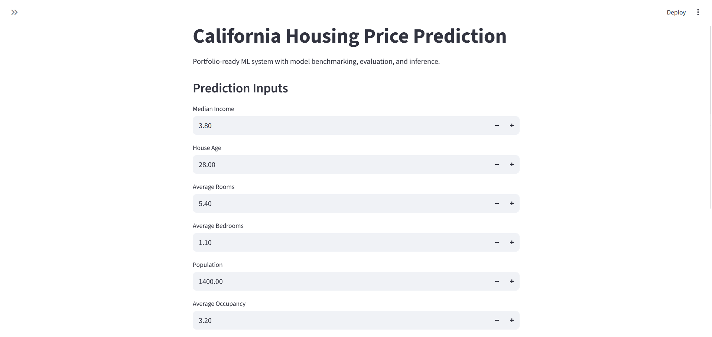
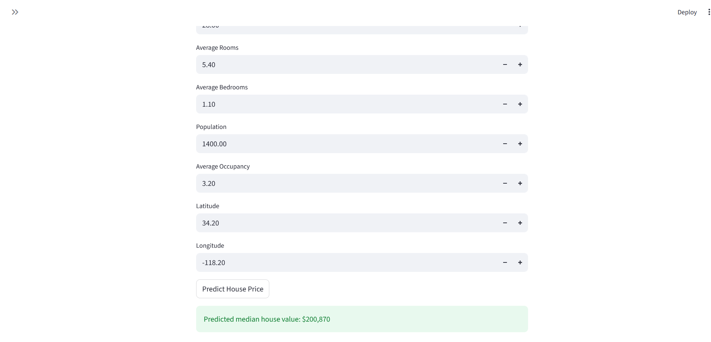

# End-to-End ML Project: California Housing Price Prediction

A production-style machine learning project designed

It includes:
- Real dataset ingestion from `sklearn.datasets.fetch_california_housing`
- Feature engineering
- Train/validation/test split
- Cross-validation model benchmarking
- Targeted hyperparameter tuning for top-performing models
- Best-model selection by RMSE
- Metrics and artifact persistence
- CLI inference, Streamlit app, and FastAPI inference service
- Dockerized API deployment path
- GitHub Actions CI for automated test validation
- Unit tests

## Project Structure

```text
prediction/
  api.py
  app.py
  Dockerfile
  main.py
  requirements.txt
  README.md
  src/
    config.py
    data.py
    train.py
    predict.py
  data/
    raw/
  models/
  tests/
```

## Setup

```bash
python -m venv .venv
.venv\Scripts\activate
pip install -r requirements.txt
```

## Run End-to-End Pipeline

```bash
python main.py
```

This command:
1. Downloads and stores California Housing data at `data/raw/california_housing.csv`
2. Benchmarks `Ridge`, `RandomForest`, `ExtraTrees`, `GradientBoosting`, and `HistGradientBoosting` using CV
3. Runs `RandomizedSearchCV` on top models for tuning
4. Selects and trains the best model
5. Saves model to `models/best_model.joblib`
6. Saves metrics to `models/metrics.json`
7. Saves benchmark summary to `models/model_registry.json`

## Latest Verified Results

The latest training artifacts (`models/metrics.json`) report:

- Selected model: `hist_gradient_boosting_tuned`
- CV RMSE: `0.4762`
- Test R2: `0.8514`
- Test RMSE: `0.4432`
- Test MAE: `0.2992`

Example CLI inference output:

```bash
Predicted house value (in $100k units): 2.2855
```

## Train Only

```bash
python -m src.train
```

## Predict from CLI

```bash
python -m src.predict --MedInc 4.2 --HouseAge 30 --AveRooms 5.6 --AveBedrms 1.1 --Population 1200 --AveOccup 3.0 --Latitude 34.2 --Longitude -118.2
```

## Run Streamlit App

```bash
streamlit run app.py
```

## Run FastAPI Service

```bash
uvicorn api:app --reload
```

Endpoints:
- `GET /health`
- `POST /train`
- `POST /predict`

Sample `POST /predict` body:

```json
{
  "MedInc": 4.2,
  "HouseAge": 30,
  "AveRooms": 5.6,
  "AveBedrms": 1.1,
  "Population": 1200,
  "AveOccup": 3.0,
  "Latitude": 34.2,
  "Longitude": -118.2
}
```

Example response:

```json
{
  "predicted_house_value_100k_units": 2.2855,
  "predicted_house_value_usd": 228550.0
}
```

## Screenshots

### Streamlit UI



### Streamlit UI



## Docker Run

```bash
docker build -t housing-ml .
docker run -p 8000:8000 housing-ml
```

## CI

GitHub Actions workflow at `.github/workflows/ci.yml` runs `pytest` on each push and pull request.

## Run Tests

```bash
pytest -q
```


